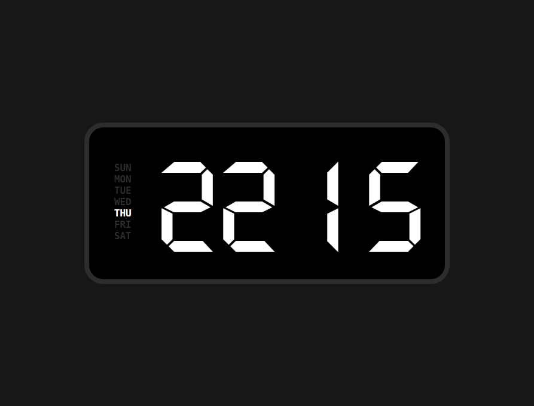

# Digital Clock

A sleek and customizable digital clock built using **HTML**, **CSS**, and **JavaScript**. This project displays the current time with stylish fonts and responsive design, making it perfect for web applications, dashboards, or learning purposes.

## Features

- Displays current time with hours, minutes, and seconds
- Highlights the current day of the week
- Custom fonts for a modern look
- Responsive and centered layout
- Easy to customize styles and fonts

## Demo

  

## Technologies Used

- **HTML5** for structure
- **CSS3** for styling and layout
- **JavaScript** for dynamic time updates

## Installation

1. Clone the repository:
   https://samwich11.github.io/digital-clock/
2. Navigate to the project directory:
3. Open `index.html` in your preferred web browser.

## Usage

- The clock automatically updates every second.
- Customize fonts and colors by editing the CSS files.
- Modify JavaScript if you want to add features like 12-hour format, alarms, or timers.

## Folder Structure
digital-clock/
├── fonts/ # Custom font files
├── style.css
├── index.js
├── index.html # Main HTML file
├── README.md # Project documentation
└── screenshot.png # Screenshot image
